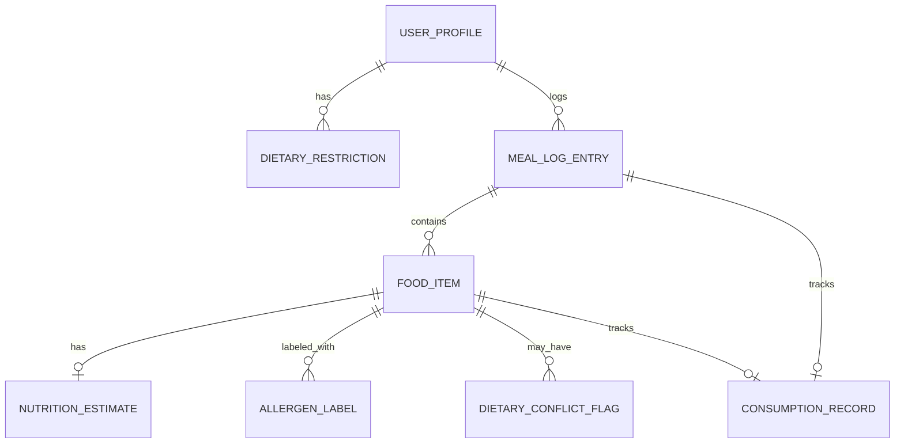

# Data Model: Meal Photo Nutrition Tracking

## Entity Overview



## Entities

### UserProfile

Represents an app user and their saved dietary restrictions.

| Field | Type | Notes |
|---|---|---|
| id | UUID | Primary key |
| createdAt | timestamp | |
| dietaryRestrictions | DietaryRestriction[] | 0..n; empty is valid (FR-016, edge case: no restrictions set) |

### DietaryRestriction

| Field | Type | Notes |
|---|---|---|
| id | UUID | Primary key |
| userId | UUID | FK → UserProfile |
| type | enum | `gluten_free`, `vegetarian`, `vegan`, `nut_allergy`, `shellfish_allergy`, `avoid_pork`, ... (extensible) |
| createdAt | timestamp | |

Validation: `type` must be from a known enum; duplicates for the same user/type are rejected.

### MealLogEntry

A single logged eating occasion.

| Field | Type | Notes |
|---|---|---|
| id | UUID | Primary key |
| userId | UUID | FK → UserProfile |
| createdAt | timestamp | |
| beforePhotoUrl | string | Object storage reference; required |
| afterPhotoUrl | string \| null | Object storage reference; present only when before/after tracking used (User Story 4) |
| foodItems | FoodItem[] | 1..n for real meals; 0 for empty-plate (FR-009) |
| combinedNutritionTotals | NutritionEstimate | Sum of item-level estimates, recalculated whenever items/consumption change |
| isFunEstimate | boolean | true only for non-food "just for fun" results (FR-007); such entries MUST NOT contribute to combinedNutritionTotals or daily totals |
| status | enum | `identified`, `needs_confirmation`, `rejected_non_food`, `rejected_low_quality`, `rejected_invalid_file`, `empty_plate` |

Validation:
- If `status` is `rejected_*`, `foodItems` MUST be empty and no real nutrition values are persisted (SC-002).
- If `isFunEstimate` is true, the entry is excluded from any daily/weekly aggregate query by construction (not just by UI filtering).

### FoodItem

A single identified food within a meal log entry.

| Field | Type | Notes |
|---|---|---|
| id | UUID | Primary key |
| mealLogEntryId | UUID | FK → MealLogEntry |
| name | string | Identified food name |
| confidence | float (0-1) | From vision provider |
| identificationStatus | enum | `confirmed`, `pending_user_confirmation` (User Story 2, scenario 6 — visually-similar foods) |
| portionEstimate | PortionEstimate | Exact value or `{min, max}` range |
| nutritionEstimate | NutritionEstimate | See below |
| dataSource | enum | `visual_estimate`, `packaged_label`, `restaurant_data` (FR-025) |
| allergenLabels | AllergenLabel[] | Always populated regardless of user restrictions (FR-015) |
| dietaryConflictFlags | DietaryConflictFlag[] | Populated only when the user has relevant restrictions on file |
| consumptionFraction | float (0-1) | Defaults to unset until the user records consumption |

Validation:
- `portionEstimate` MUST be labeled approximate (a range, not a point value) whenever the source estimation had ambiguous scale references (FR-010) or hidden ingredients (FR-012).
- A `FoodItem` with `identificationStatus = pending_user_confirmation` MUST NOT be included in `combinedNutritionTotals` until confirmed (User Story 2, scenario 6).
- A `FoodItem` with an unresolved `DietaryConflictFlag` MUST NOT be persisted as logged/consumed until the user confirms ingredients (FR-018).

### PortionEstimate (value object, embedded in FoodItem)

| Field | Type | Notes |
|---|---|---|
| amount | number \| null | Set when a confident scale reference exists |
| rangeMin | number \| null | Set when amount is null (approximate case) |
| rangeMax | number \| null | Set when amount is null |
| unit | string | e.g., grams |
| isApproximate | boolean | true whenever range fields are used, or hidden ingredients reduce certainty |
| portionConfidenceWarning | string \| null | Set when portion size could not be reliably determined at all (FR-011) |

### NutritionEstimate (value object, embedded in FoodItem and MealLogEntry)

| Field | Type | Notes |
|---|---|---|
| calories | number | |
| proteinG | number | |
| carbsG | number | |
| fatG | number | |
| micronutrients | Map<string, number> | Vitamins/minerals keyed by standard nutrient name |
| isApproximate | boolean | true when portion is approximate or ingredients are hidden |
| uncertaintyReason | string \| null | e.g., "hidden ingredients", "ambiguous portion" (FR-012) |

### AllergenLabel (value object, embedded/attached to FoodItem)

| Field | Type | Notes |
|---|---|---|
| allergen | enum | `shellfish`, `peanuts`, `tree_nuts`, `pork`, ... (extensible, minimum set per FR-015) |

### DietaryConflictFlag

| Field | Type | Notes |
|---|---|---|
| id | UUID | Primary key |
| foodItemId | UUID | FK → FoodItem |
| restrictionType | enum | Matches `DietaryRestriction.type` |
| reason | enum | `conflict_detected`, `cannot_verify` (FR-017/FR-018) |
| confirmedByUser | boolean | Must be true before the item counts toward logged/consumed totals |

### ConsumptionRecord

The recorded portion of a meal or food item actually eaten.

| Field | Type | Notes |
|---|---|---|
| id | UUID | Primary key |
| mealLogEntryId | UUID | FK → MealLogEntry |
| foodItemId | UUID \| null | Null when recorded at the whole-meal level; set for per-item tracking (FR-020) |
| method | enum | `manual_fraction`, `per_item`, `photo_comparison` |
| consumedFraction | float (0-1) | e.g., 1.0, 0.5, 0.25, 0 (FR-019) |
| derivedFromAfterPhotoUrl | string \| null | Set when `method = photo_comparison` |
| removalSuspected | boolean | true when the app suspects food was removed rather than eaten, pending user confirmation (FR-022) |
| addedFoodDetected | boolean | true when the after-photo shows food not present in the before-photo (FR-023) |

Validation:
- `consumedFraction` scaling MUST be applied to every nutrient field in the associated `NutritionEstimate`, not just calories (FR-019), within the 5% tolerance defined in SC-004.
- When `removalSuspected` is true, the record MUST NOT be treated as consumed until the user confirms (FR-022).

## State Transitions

**MealLogEntry.status**:

```
(upload) → quality_check → content_classification
  ├─ fails quality → rejected_low_quality (terminal)
  ├─ no food detected → rejected_non_food (terminal; may attach isFunEstimate result)
  ├─ empty plate → empty_plate (terminal, 0 calories)
  └─ food detected → identified
        └─ any FoodItem has unresolved conflict/ambiguous ID → needs_confirmation
              └─ user confirms all → identified
```

**FoodItem.identificationStatus**: `pending_user_confirmation → confirmed` (one-way; a user correction re-runs nutrition calculation per FR-027 but keeps the item `confirmed` under its corrected name).
